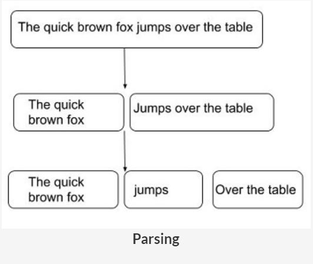
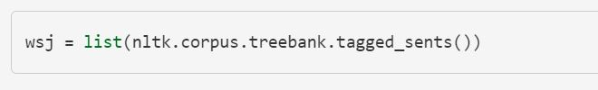
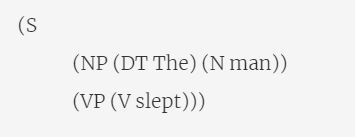
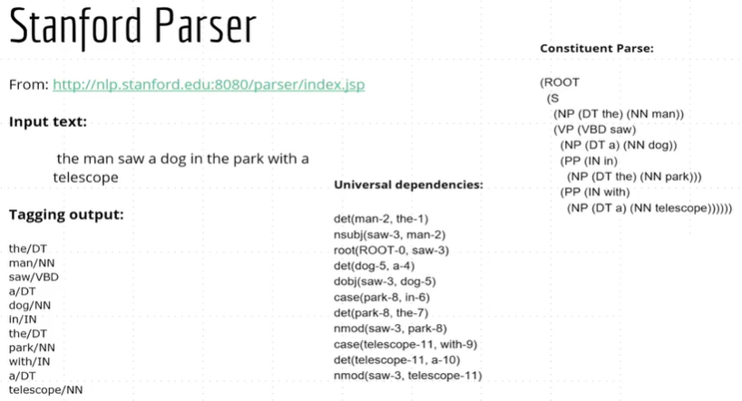
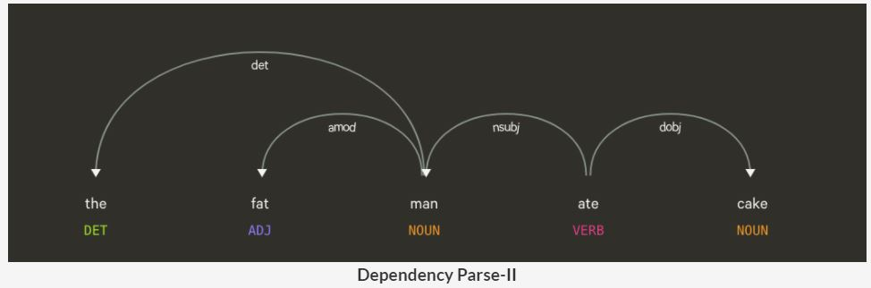
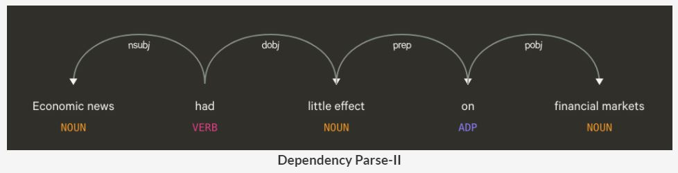
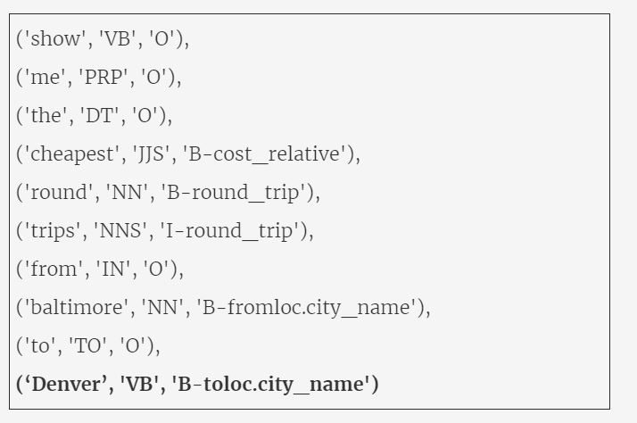

# Syntactic Processing

## Introduction
**In this module**, you will learn algorithms and techniques used to analyse the syntax or the grammatical structure of sentences. In the first session, you will learn the basics of grammar (part-of-speech tags etc.) and write your own algorithms such as **HMMs(Hidden Markov Models) to build POS taggers**. In the second session, you will study algorithms to **parse the grammatical structure** of sentences such as CFGs, PCFGs and dependency parsing. Finally, in the third session, you will learn to build an **Information Extraction (IE)** system to parse flight booking queries for users using techniques such as **Named Entity Recognition (NER)**. You will also study a class of models called **Conditional Random Fields (CRFs)** which are widely used for building NER systems.

All these techniques fall under what is called **syntactic processing**.  

Syntactic processing is widely used in applications such as question answering systems, information extraction, sentiment analysis, grammar checking etc.

### The What and Why of Syntactic Processing
Let’s start with an example to understand **Syntactic Processing**:
* Canberra is the capital of Australia.
* Is Canberra the of Australia capital.

Both sentences have the same set of words, but only the first one is syntactically correct and comprehensible. Basic lexical processing techniques wouldn't be able to tell this difference. Therefore, more sophisticated syntactic processing techniques are required to understand the relationship between individual words in the sentence.

Lexical analysis is data pre-processing and feature extraction step. It involves the analysis at word level. Syntactical analysis aims at finding structural relationships among the words of a sentence.

We’ve learnt about lexical processing in the last module. Lexical analysis aims at data cleaning and feature extraction, which it does by using techniques such as lemmatization, removing stopwords, rectifying misspelt words, etc. But, in syntactic analysis, our aim will be to understand the roles played by the words in the sentence, the relationship between words and to parse the grammatical structure of sentences. 

Now that we understand the basic idea of syntactic processing, let's study the different levels of syntactic analysis.

### Parsing
A key task in syntactical processing is **parsing**. It means to break down a given sentence into its 'grammatical constituents'. Parsing is an important step in many applications which helps us better understand the linguistic structure of sentences.

Let’s understand parsing through an example. Let's say you ask a question answering (QA) system, such as Amazon's Alexa or Apple's Siri, the following question: "Who won <ins>the cricket world cup in 2015</ins>?"

The QA system can respond meaningfully only if it can understand that the phrase <ins>'cricket world cup'</ins> is related to the phrase 'in 2015'. The phrase <ins>'in 2015'</ins> refers to a specific time frame, and thus modifies the question significantly. Finding such dependencies or relations between the phrases of a sentence can be achieved using parsing techniques.

Let's take another example sentence to understand how a parsed sentence looks like: "The quick brown fox jumps over the table". The figure given below shows the three main constituents of this sentence. Note that actual parse trees are different from the simplified representation below.

This structure divides the sentence into three main constituents:
* 'The quick brown fox' is a noun phrase 
* 'jumps' is a verb phrase
* 'over the table' is a prepositional phrase.

To summarise, you will study the following levels of syntactic analysis in this module:
* Part-of-speech (POS) tagging
* Constituency parsing
* Dependency parsing

Let’s understand the levels of syntax analysis using an example sentence: "The little boy went to the park."

**POS tagging** is the task of assigning a part of speech tag (POS tag) to each word. The POS tags identify the linguistic role of the word in the sentence. The POS tags of the sentence are:

**Constituency parsers** divide the sentence into constituent phrases such as noun phrase, verb phrase, prepositional phrase etc. Each constituent phrase can itself be divided into further phrases. The constituency parse tree given below divides the sentence into two main phrases - a noun phrase and a verb phrase. The verb phrase is further divided into a verb and a prepositional phrase, and so on.

**Dependency Parsers** do not divide a sentence into constituent phrases, but rather establish relationships directly between the words themselves. The figure below is an example of a dependency parse tree of the sentence given above (generated using the spaCy dependency visualiser(https://explosion.ai/demos/displacy?text=The%20little%20boy%20went%20to%20the%20park&model=en_core_web_sm&cpu=0&cph=0)). In this module, you’ll understand when dependency parsing is more useful than constituency parsing and study the elements of dependency grammar.

We will study these parsing techniques in the sections that follow. In the next few segments, we will study POS tagging in detail.

### Parts-of-Speech
Let’s start with the first level of syntactic analysis- POS (parts-of-speech) tagging. A word can be tagged as a noun, verb, adjective, adverb, preposition etc. depending upon its role in the sentence. Assigning the correct tag such as noun, verb, adjective etc. is one of the most fundamental tasks in syntactic analysis.  

Let’s say you ask your smart home device a question - "Ok Google, where can I get the permit to work in Australia?". Now, the word 'permit' can potentially have two POS tags - noun and a verb. In the phrase 'I need a work permit', the correct tag of 'permit' is 'noun'. On the other hand, in the phrase "Please permit me to take the exam.", the word 'permit' is a 'verb'.

Assigning the correct POS tags helps us better understand the intended meaning of a phrase or a sentence and is thus a crucial part of syntactic processing. In fact, all the subsequent parsing techniques (constituency parsing, dependency parsing etc.) use the part-of-speech tags to parse the sentence. 

**Note**: You do not need to remember all the POS tags except for a few which are listed later on this page. You’ll pick up most of these tags as you work on the problems in the coming segments, but it’s important to be aware of all the types of tags. Now, let’s look at some other tags.

There are 36 POS tags in the Penn treebank in NLTK. The file given below enlists the most commonly used POS tags. It is recommended to remember these common tags. It’ll help you avoid the trouble of looking up meanings of tags in the upcoming segments, so you can focus on the core concepts.  

[POS tags](dataset/POS_tags.pdf)

Note that the set of POS tags is not standard - some books/applications may use only the base forms such as NN, VB, JJ etc without using granular forms, though NLTK uses this set of tags(https://www.ling.upenn.edu/courses/Fall_2003/ling001/penn_treebank_pos.html). Since we'll use NLTK heavily, we recommend you to read through this list of tags at least once.

### Additional Reference:
Refer to segments 1 & 2 of the POS tagging chapter of NLTK (http://www.nltk.org/book/ch05.html).

### Different Approaches to POS Tagging
Now that you are familiar with the commonly used POS tags, we will discuss techniques and algorithms for POS tagging. We will look at the following four main techniques used for POS tagging:
* Lexicon-based
* Rule-based
* Probabilistic (or stochastic) techniques
* Deep learning techniques

This session will cover the first three tagging approaches in detail and the basics of deep-learning based taggers. Deep-learning based models will be covered in detail in the Neural Networks section.

The four approaches of POS tagging are as follows:

**The lexicon-based** approach uses the following simple statistical algorithm: for each word, it assigns the POS tag that most frequently occurs for that word in some training corpus. Such a tagging approach cannot handle unknown/ambiguous words. For example:
* I went for a **run/NN**
* I **run/VB** in the morning
Lexicon tagger will tag 'run' basis the highest frequency tag. In most contexts, 'run' is likely to appear as a verb, implying that 'run' will be wrongly tagged in the first sentence.

But if there’s a rule that is applied to the entire text, such as, 'replace VB with NN if the previous tag is DT', or 'tag all words ending with ing as VBG', the tag can be corrected. **Rule-based** tagging methods use such an approach. Rule-based taggers are also known as syntagmatic taggers.

**Probabilistic taggers** don't naively assign the highest frequency tag to each word, instead, they look at slightly longer parts of the sequence and often use the tag(s) and the word(s) appearing before the target word to be tagged.

We’ll go through the details of probabilistic tagging approaches in the upcoming segments.

### Lexicon and Rule-based POS Tagging
We saw that the **lexicon tagger** uses a simple statistical tagging algorithm: for each token, it assigns the most frequently assigned POS tag. For example, it will assign the tag "verb" to any occurrence of the word "run" if "run" is used as a verb more often than any other tag.

**Rule-based taggers** first assign the tag using the lexicon method and then apply predefined rules. Some examples of rules are:
1. Change the tag to VBG for words ending with ‘-ing’
2. Changes the tag to VBD for words ending with ‘-ed’
3. Replace VBD with VBN if the previous word is 'has/have/had'

Defining such rules require some exploratory data analysis and intuition.

In this segment, we’ll learn to implement the lexicon and rule-based tagger on the Treebank corpus of NLTK(http://www.nltk.org/howto/corpus.html#corpus-reader-objects). Let’s first explore the corpus.

#### Programming Exercise - Exploratory Analysis for POS Tagging
In the following practice exercise, you will use the Jupyter notebook attached below to answer the following questions. The notebook contains some starter code to read the data and explain its structure. We recommend you to try answering the questions by writing code to conduct some exploratory analysis.

[Treebank EDA](dataset/Treebank_EDA.ipynb)

Now that you have an intuition of how lexicon and rule-based taggers work, let's build these taggers in NLTK. Since NLTK comes with built-in functions for lexicon and rule-based taggers, called Unigram and Regular Expression taggers respectively in NLTK, we'll use them to train taggers using the Penn Treebank corpus.

You can refer to this Stack Overflow answer to learn more about the backoff technique(https://stackoverflow.com/questions/17259970/tagging-pos-in-nltk-using-backoff-ngrams). Next, you will study a widely used probabilistic POS tagging model - the Hidden Markov Model (HMM).

### Stochastic Parsing
In the following segments, we’ll study a commonly used probabilistic algorithm for POS tagging - the Hidden Markov Model (HMM). 

Before moving ahead, it will be useful to recall the **Bayes’ theorem** and the chain rule of probability which you had learnt in the Naive Bayes module. Say you have two features X= (x1, x2) and a binary target variable y (class = 0/1). According to the **Bayes’ rule**, the probability of a point (x1, x2) belonging to the class c1 is given by:

Now, according to the **chain rule of probability**, the term P(x1, x2 | c1) can be rewritten as P(x1|c1). P(x2|c1).  You can now compute all the probabilities on the right-hand side to compute P(class = c1 | x1, x2).

A similar idea is used by probabilistic parsers to assign POS tags to sequences of words. Say you want to tag the word sequence ‘The high cost’ and you want to compute the probability that the tag sequence is (DT, JJ, NN). For simplicity, let's work with only these three POS tags, and also assume that only three tag sequences are possible - (DT, JJ, NN), (DT, NN, JJ) and (JJ, DT, NN).

The probability that the tag sequence is (DT, JJ, NN) can be computed as:

Similarly, we can compute the probabilities of the other two sequences and assign the sequence that has the maximum probability. We will need to use some simplifying assumptions to compute the right-hand side of the equation. Let’s see how.

Let’s analyse the process of stochastic parsing step by step.

The objective is to find the **most probable POS tag sequence** for the phrase: 'The high cost'.We have made a simplifying assumption that only three possible tags exist: Determinant (DT), Adjective (JJ) and Noun(NN).

Each word in the sentence can be assigned any one of the three tags DT, JJ or NN. So, there could be 3^3 = 27 possible tag sequences (DT-DT-DT, DT-JJ-NN, DT-JJ-JJ, ....). For simplicity, we’ll consider only these three possible tag sequences:
1. (DT, JJ, NN)
2. (DT, NN, JJ)
3. (JJ, DT, NN)

We need to find the maximum of [P(**tag sequence|observation sequence**)] among the possible tag sequences. Let’s start with first tag sequence: (DT, JJ, NN)

We make an important assumption here called the **Markov assumption**. (You’ll learn about the Markov process formally in the upcoming segments). Briefly, a Markov process transitions from one 'state' to another with some probability. In this case, the states are the POS tags.

The Markov assumption states that the probability of a state depends only on the probability of the previous state leading to it. That implies, in a tag sequence (DT, JJ, NN), the probability that a word is tagged as NN depends only on the previous tag JJ and not on DT. 

Another simplifying assumption we make is that the probability of a word w being assigned a tag t depends only on the tag t and not on any other tag. Thus, the probability P(the|DT), i.e. the probability that a word is 'the' given its tag is DT, depends only on DT and not on any of the other tags NN or JJ.

Simplifying the equation using these assumptions, we get:

The denominator can simply be ignored since it is the same across all candidate sequences.

In the next segment, you’ll see how to optimally arrive at a solution for getting the most probable tag sequence without calculating the probabilities for the 27 tag sequences.

### The Viterbi Heuristic
In the previous segment, you learnt how to calculate the probability of a tag sequence given a sequence of words. The idea is to compute the probability of all possible tag sequences and assign the sequence having the maximum probability.

Although this approach can work in principle, it is computationally very expensive. For e.g. if you have just three POS tags - DT, JJ, NN, and you want to tag the sentence "The high cost", there are 

Clearly, computing trillions of probabilities to tag a 10-word sentence is impractical. Thus, we need to find a much more efficient approach to tagging. 

 One such approach called the **Viterbi heuristic**, also commonly known as the **Viterbi algorithm**.

This is also why it is called a greedy algorithm - it assigns the tag that is most likely at every word, rather than looking for the overall most likely sequence. In the following segment we will compare the computational costs of the two tagging algorithms - the brute force algorithm and the Viterbi algorithm.

### Markov Chain and HMM
Markov models are probabilistic (or stochastic) models that were developed to model sequential processes. In a Markov process, it is usually assumed that the probability of each event (or state) depends only on the probability of the previous event. This simplifying assumption is a special case which is known as the Markovian, one-Markov and the first-order Markov assumption. 

Let’s summarise the theory of Markov processes and HMMs.

A Markov chain is used to represent a process which performs a transition from one state to other. This transition makes an assumption that the probability of transitioning to the next state is dependent solely on the current state. Consider the figure below:

Here, ‘a’, ‘p’, ‘i’, ‘t’, ‘e’, ‘h’ are the **states** and the numbers mentioned on the edges are **transition probabilities**. For e.g. the probabilities of transitioning from the state ‘t’ to the states ‘i’, 'a' and 'h' are 0.3, 0.3, 0.4 respectively.

The **start state** is a special state which represents the initial state of the process (e.g. the start of a sentence).

**Markov processes** are commonly used to model sequential data, such as text and speech. For e.g., say you want to build an application which predicts the next word in a sentence. You can represent each word in a sentence as a state. The transition probabilities (which can be learnt from some corpus, more on that later) would represent the probability that the process moves from the current word to the next word. For e.g. the transition probability from the state 'San' to 'Franciso' will be higher than to the state 'Delhi'.

The **Hidden Markov Model (HMM)** is an extension to the Markov process which is used to model phenomena where the **states are hidden** (or latent) and they **emit observations**. For example, in a speech recognition system (a speech-to-text converter), the states represent the actual text words which you want to predict, but you do not directly observe them (i.e. the states are hidden). Rather, you only observe the speech (audio) signals corresponding to each word, and you need to infer the states using the observations.

Similarly, in POS tagging, what you observe are the words in a sentence, while the POS tags themselves are hidden. Thus, you can model the POS tagging task as an HMM with the hidden states representing POS tags which emit observations, i.e. words.

The hidden states **emit observations** with a certain probability. Therefore, along with the transition and initial state probabilities, Hidden Markov Models also have **emission probabilities** which represent the probability that an observation is emitted by a particular state.

The figure below illustrates the emission and transition probabilities for a hidden Markov process having three hidden states and four observations.

In the previous segment, you had used the transition and the emission probabilities for finding the most probable tag sequence for the sentence "The high cost". The probabilities P(NN|JJ), P(JJ|DT) etc. are transition probabilities, while the P(high|JJ), P(cost|NN) etc. are the emission probabilities.

### Explanation Problem
In the previous segment, you learnt how the POS tagging problem can be modelled using an HMM. You saw that the sequence of words are the observations while the POS tags are the hidden states. Also, the HMM is represented by its initial state probabilities (i.e. the probability of transition into any state from the initial state), the transition and the emission probabilities.

These probabilities are usually learnt from a training corpus. For now, let's assume that you have already learnt these probabilities. Then, the **explanation problem**, also called the **decoding problem**, is as follows: Given a sequence of words/observations and an HMM model (i.e. transition, emission and start state probabilities), find the tag/state sequence which maximises the probability of observing the observed words. 

To summarise, since the explanation problem is exponential in the number of tags, we need to find a more efficient algorithm to solve it. You already know that the Viterbi algorithm solves this problem. 

Let us see how to visualise the HMM as a trellis and solve the problem explanation problem using the Viterbi algorithm.

Thus, we have used the same phrase for tagging 'The high cost' and have assumed that we have only three possible tags - DT, JJ, NN. We have also assumed some emission (P('the'|DT),  P( 'the '|NN), P('high'|JJ), etc.) and transition probabilities (P(NN|JJ), P(JJ|DT), P(DT|JJ), etc.). You'll learn how to calculate these probabilities from a tagged corpus in the next segment.

We will demonstrate how to calculate the most probable tag sequence using the Viterbi Heuristic.

Note that the Viterbi algorithm, as demonstrated in the previous lecture, is an example of a dynamic programming algorithm. In general, algorithms which break down a complex problem into subproblems and solve each subproblem optimally are called dynamic programming algorithms. 

Until now, we had assumed some initial state, transition and emission probabilities and used them to compute the optimal tag sequence. But how do you actually learn these probabilities? This task is done using some tagged corpus, such as the Penn Treebank, and is called **the learning problem**.

In the next segments, you'll learn to solve the learning problem and write an algorithm Python to train your own HMM model using the Viterbi algorithm.

#### Additional References:

Likelihood problem of predicting the next possible word can be solved using forward algorithm. You can read about it in more detail from this link: https://web.stanford.edu/~jurafsky/slp3/9.pdf   (Refer to the section 9.3)

### Learning HMM Model Parameters
In this segment, you'll learn to compute the emission & transition probabilities from a tagged corpus. This process of learning the probabilities from a tagged corpus is called **training an HMM model**.

To summarise, the emission and the transition probabilities can be learnt as follows:

**Emission Probability** of a word 'w' for tag 't':  
P(w|t) = Number of times w has been tagged t/Number of times t appears

**Transition Probability** of tag t1 followed by tag t2:  
P(t2|t1) = Number of times t1 is followed by tag t2/ Number of times t1 appears

### HMM and the Viterbi Algorithm: Pseudocode
You have learnt the basic idea behind the two main problems in building an HMM for POS tagging  - the learning problem (learning the probabilities) and the explanation problem (solved using the Viterbi algorithm). In the next segment, you will learn to build an HMM using the Penn Treebank as the training corpus.

Before that, let's take a while to reiterate the important concepts and understand the pseudocode of this program.

The Penn Treebank is a manual of around a million words taken from 1989 Wall Street Journal's articles. This manual is available in NLTK toolkit of Python. You can explore this data by importing NLTK and then run the following code:

The 'wsj' object is a list of list of tuples. Each tuple is in the form of (word, POS tag). You have already performed EDA on the Treebank data while building the lexicon and rule-based taggers.

### Learning the HMM Model Parameters
Let's start with training the HMM to learn the probabilities. For this, you need to calculate the **transition probability** (from one state to another), the **emission probability** (of a state emitting a word), and the **initial state probabilities** (of a state appearing at the start of a sentence).

**Transition Probability**  
Transition probability is the probability of moving from one state to another. You learnt how to calculate it in the last segment.  Let’s write the pseudocode to calculate the transition probabilities.

### The Explanation/Decoding Problem: Viterbi Algorithm
After learning the model parameters, we need to find the best possible state (tag) sequence for each given sentence. We'll use the Viterbi algorithm - for every word w in the sentence, a tag t is assigned to w such that it maximises the likelihood of the occurrence of P(tag|word).

In other words, we assign the tag t to the word w which has the max P(tag|word).  

We'll keep on storing the assigned tags and words as a list of tuples. As we move to the next word in the list, each tag to be assigned will use the tag of the previous word. You may find **the trellis** quite useful to visualise the algorithm. 

For the start word of a sentence, which is a 'boundary case', the sentence terminator of the previous tag can be used to calculate the initial state probabilities.

This forms the basis of developing a POS tagger using the Viterbi heuristic. In the next segment, we'll see how to implement this pseudocode in Python.

### HMM & the Viterbi Algorithm: Python Implementation
You will now learn to build an HMM POS tagger using the Penn Treebank dataset as the training corpus.
In the following few exercises, you will learn to do the following in Python:

We will explain the Python implementation step-by-step. Please download the following Jupyter notebook.

[Viterbi POS tagging](dataset/POS_Tagging_HMM.ipynb)

So, we explored the Penn Treebank data set. The tagged sentences are in the form of a list of tuples, where the first element of the tuple is a word and the second element is the POS tag of the word. We have also sampled the data into train and test sets.

You saw how to compute the emission, transition and the initial state probabilities (P(tag | start)). Note that a sentence can end with either of the three terms '.', '?' or '!'. They are all called sentence terminators and are tagged as '.'. Thus, P(tag|start) is equivalent to P(tag| '.').

Next, you'll compute the transition probabilities matrix and finally use the emission and the transition probabilities to write the Viterbi algorithm for tagging a given sequence of words.

To summarise, the Viterbi algorithm works as follows:

For each word, we compute the P(tag|word) for each tag in the tag set and then assign the tag having the max P(tag/word).

P(tag|word)  = (emission probability of the word-tag pair) * (transition probability from the previous tag).

As we move along each word, we keep on storing the assigned tags in a list. As we progress further down the sequence, each word uses the tag of the previous token to compute the transition probabilities. 

Let's evaluate the accuracy of the Viterbi algorithm on the test dataset. Predicting the tags of the entire test-set takes about 3-4 hours. So, we'll compute the tagging accuracy on a few randomly chosen sentences.

The Viterbi algorithm gave us approximately 87% accuracy. The 13% loss of accuracy, to a large part, can be attributed to the fact that when the algorithm hits an unknown word (i.e. not present in the training set), it naively assigns the first tag in the list of tags that we have created. In this case, the first tag happens to be JJ, so it assigns JJ to all unknown words.

### Improving the Performance of the POS Tagger
You can, of course, try to improve the accuracy of the model further by making some modifications. For example, you can start by tagging the unknown words more smartly. Also, using some exploratory analysis, you can identify whether any particular sets of tags or words constitute to a large number of errors, understand the source of those errors, and address them head-on. These are left as exercises for you. 

In the next segment, you will briefly understand the fundamentals of Recurrent Neural Networks (RNNs) and how they are used for POS tagging.

### Deep Learning Based POS Taggers
Apart from conventional sequence models such as HMMs, significant advancement has been made in the field of Neural Networks (or deep learning) based sequence models. Specifically, **Recurrent Neural Networks (RNNs)** have empirically proven to outperform many conventional sequence models for tasks such as POS tagging, entity recognition, dependency parsing etc. 

Though you’ll learn RNNs in detail later in the Neural Network course, this segment will give you a brief overview of how you can build POS taggers using RNNs.

We will study RNNs in much more detail in the Neural Networks course. 

## Parsing

### Introduction
In the previous session, we had mentioned that there are three broad levels of syntactic processing:
* Part-of-speech tagging
* Constituency parsing
* Dependency parsing
 
You have studied POS tagging in detail, though that is not enough for understanding the complex grammatical structures and ambiguities in sentences which most human languages comprise of.

Therefore, we need to learn techniques which can help us understand the grammatical structures of complex sentences. **Constituency parsing** and **dependency parsing** can help us achieve that.

### Why Shallow Parsing is Not Sufficient
Shallow parsing, as the name implies, refers to fairly shallow levels of parsing such as POS tagging, chunking, etc. (you will learn chunking in the next session). But such techniques would not be able to check the grammatical structure of the sentence, i.e. whether a sentence is grammatically correct, or understand the dependencies between words in a sentence.

Let's see why deeper parsing techniques are required.

Thus, POS tagging will although help us identify the linguistic role of the word in a sentence, it wouldn't enable us to understand how these words are related to each other in a sentence.

In the next few segments, you'll learn about **constituency** and **dependency parsers**.

### Constituency Grammars
To deal with the complexity and ambiguity of natural language, we first need to identify and define commonly observed grammatical patterns. 

The first step in understanding grammar is to divide a sentence into **groups of words** called **constituents** based on their grammatical role in the sentence.

To start with, let's take an example sentence: “<ins>The fox  ate the squirrel</ins>.”

Each underlined group of words represents a grammatical unit or a constituent - "The fox" represents a noun phrase, "ate" represents a verb phrase, "the squirrel" is another noun phrase.

In the upcoming few lectures, you will study how **constituency parsers** can 'parse' the grammatical structure of sentences. Let's first understand the concept of **constituents**.

Let's understand the concept of constituencies in a little more detail. Consider the following two sentences:
* <ins>'Ram<ins>   <ins>read</ins>   <ins>an article on data science'</ins>
* <ins>'Shruti</ins>    <ins>ate</ins>    <ins>dinner'</ins> 

The underlined groups of words form a constituent (or a phrase). The rationale for clubbing these words in a single unit is provided by the notion of **substitutability**, i.e., a constituent can be replaced with another equivalent constituent while keeping the sentence **syntactically valid**.

For example, replacing the constituency 'an article on data science' (a noun phrase) with 'dinner' (another noun phrase) doesn't affect the syntax of the sentence, though the resultant sentence "Ram read dinner" is semantically meaningless.

Most common constituencies in English are Noun Phrases (NP), Verb Phrases (VP), and Prepositional Phrases (PP). The following table summarises these phrases:

There are various other types of phrases, such as an **adverbial phrase**, a **nominal** (N), etc., though in most cases you will need to work with only the above three phrases along with the nominal (introduced in a later segment).

### Context-Free Grammars
The most commonly used technique to organize sentences into constituencies is **Context-Free Grammars or CFGs**. CFGs define a set of **grammar rules** (or productions) which specify how words can be grouped to form constituents such as noun phrases, verb phrases, etc.

Let us see the elements of a context-free grammar.

To summarise, a context-free grammar is a series of production rules. Let’s understand production rules using some examples. The following production rule says that a noun phrase can be formed using either a determiner (DT) followed by a noun (N) or a noun phrase (NP) followed by a prepositional phrase (PP). :

NP -> DT N | NP PP

Some example phrases that follow this production rule are: 
* The/DT man/N
* <ins>The/DT man/N over/P the/DT bridge/N</ins>

Both of the above are noun phrases NP. The man is a noun phrase that follows the first rule:
NP -> DT N.

The second phrase (<ins>The man</ins>  <ins>over the bridge</ins>) follows the second rule:
NP -> NP PP

It has a noun phrase (<ins>The man</ins>) and a prepositional phrase (<ins>over the bridge</ins>).

In this way, using grammar rules, you can parse sentences into different constituents. In general, any production rule can be written as A -> B C, where A is a **non-terminal** symbol (NP, VP, N etc.) and B and C are either non-terminals or **terminal symbols** (i.e. words in vocabulary such as flight, man etc.). 

Some other examples of commonly observed production rules in English grammar are provided in the table below. Note that a nominal (Nom) refers to an entity such as morning, flight etc. which commonly follows the rule Nominal > Nominal Noun. There is a subtle difference and a significant overlap between a nominal (Nom) and a noun (NN), you may read more about it here(https://en.wikipedia.org/wiki/Nominal_group_(functional_grammar), though you need not worry much about these nuances.

The symbol S represents an entire sentence.

Further, there are two broad approaches for parsing sentences using CFGs:
1. **Top-down**: Start from the starting symbol S and produce each word in the sentence
2. **Bottom-up**: Start from the individual words and reduce them to the sentence S

### Top-Down Parsing
Until now, we have learnt about the basics of phrases, CFGs and how CFGs can be used for parsing sentences. Let's now study algorithms for parsing. There are two broad approaches for parsing:
1. **Top-down**: Start from the starting symbol S and produce each word in the sentence
2. **Bottom-up**: Start from the individual words and reduce them to the sentence S

You have studied that CFGs define what are called grammar or **production rules** of the form A > BC. Both parsing techniques use these rules to create parse trees. 

Let's first study **top-down parsing**.

To summarise, top-down parsing starts with the start symbol S at the top and uses the production rules to parse each word one by one. You continue to parse until all the words have been allocated to some production rule. 

The figure below shows all the paths the parser tried for parsing "The man saw dogs".

In the process, you often encounter **dead ends**, i.e. points where no production rule can be applied to produce a right-hand side from the left-hand side. In such cases, the algorithm needs to **backtrack** and try some other rule.

Let's understand this through an example of a simple sentence and production rules.

The sentence couldn’t be parsed using the left side of the tree since it reached a dead end. On the other hand, the grammar used on the right side is able to parse the sentence completely.

The NLTK library in Python will show the parse tree as:

Note that the **recursive descent parser** is a type of top-down parser, though the terms are sometimes used equivalently. You can read more about the recursive descent parser in the additional reading material below.

Let’s understand the problem of **left-recursion** using an example: 
**Sentence**: The man saw a car. 
**Grammar**:  
S -> NP VP 
NP -> DT N 
VP -> VP NP| V 
DT -> the 
N -> man 

The top-down parse structure of the sentence will look as follows:

The rule VP -> VP NP runs into an **infinite loop** and no parse tree will be obtained. This is the problem of left recursion. This problem can be resolved using the bottom-up approach, which you'll learn in the next segment. 

For now, let's look at Python implementation of the top-down Parse tree. The following Jupyter notebook is attached for your reference.

[Top-down Parsing](dataset/Top+Down+parsing.ipynb)

### Additional Reading
Although the naive implementation of the recursive descent parser suffers from the problem of left-recursion, alternate algorithms have been suggested which can handle this problem. The algorithms use predictive techniques to 'look ahead' and avoid going down the infinite loop. Read more about it here(https://en.wikipedia.org/wiki/Recursive_descent_parser).

### Bottom-Up Parsing
In the previous segment, you studied the top-down parser and the problem of left-recursion. In this segment, you'll learn another approach to parse a sentence- the **bottom-up approach**.

The bottom-up approach reduces each terminal word to a production rule, i.e. reduces the right-hand-side of the grammar to the left-hand-side. It continues the reduction process until the entire sentence has been reduced to the start symbol S. 

There are many types of bottom-up parsers. The **shift-reduce parser** is one of the most commonly used bottom-up parsing algorithm. Let's consider the following sentence and grammar:

**Sentence**: The angry bear chased the squirrel

Bottom-up parsing is done using the **shift-reduce algorithm**. As an example, we will take the sentence "The angry bear chased the squirrel" and use some production rules to implement the shift-reduce algorithm.

To summarise, the shift-reduce parser parses the words of the sentence one-by-one either by **shifting** a word to the stack or **reducing** the stack by using the production rules. 

In the next segment, we'll see the Python implementation of the shift-reduce parser.  The following Jupyter notebook is attached for your reference.

[Shift Reduce Parser](dataset/Bottom+Up+parsing.ipynb)

### Ambiguities in Parse Trees

In one of the questions above, you saw that the sentence "The man caught fish with a net" can have two valid parses. In one parse, the prepositional phrase "with a net" is associated with "The man" whereas in another parse it is associated with "fish".

Now, from common sense, you know that the phrase "with a net" is associated with "The man", i.e. it is the man who has the net, not the fish. But how do you make the algorithm use this common sense?

Well, your common sense arises from the fact that it is more likely that the man has the net, not the fish. As always, the way to make algorithms understand the concept of likelihood is to use **probabilistic techniques**.

In the next segment, you will learn **probabilistic context-free grammars or PCFGs**.

### Probabilistic CFG
Until now, you have seen sentences which resulted in a single parse tree. But what if you encounter an ambiguous sentence and grammar which could lead to multiple parse trees? 

Consider the following sentence: “Look at the man with one eye.” There are two possible meanings of the sentence:

Look at the man using only one of your eyes

Similarly, in the previous segment, you had built two parse trees for another ambiguous sentence - "the man caught fish with a net". 

In general, since natural languages are inherently ambiguous (at least for computers to understand), there are often cases where multiple parse trees are possible. In such cases, we need a way to make the algorithms figure out the most likely parse tree.

You saw examples of sentences where ambiguities lead to multiple parse trees. Note that both top-down and bottom-up techniques will generate multiple parse trees. None of these trees is grammatically incorrect, but some of these are improbable to occur in normal conversations.  To identify which of these trees is the most probable, we use the notion of **probability**.

**Probabilistic Context-Free Grammars (PCFGs)** are used when we want to find the most probable parsed structure of the sentence. PCFGs are grammar rules, similar to what you have seen, along with probabilities associated with each production rule. For example, an example production rule is as follows:

NP -> Det N (0.5) | N (0.3) |N PP (0.2)

It means that the probability of an NP breaking down to a ‘Det N’ is 0.50, to an 'N' is 0.30 and to an ‘N PP’ is 0.20. Note that the sum of probabilities is 1.00.

Let’s now learn how to implement PCFG in Python. Jupyter notebook  has been attached for your reference.

[PCFG Python-Code](dataset/Parsing+using+PCFG.ipynb)

You studied the idea of CFGs and PCFGs and how to build PCFG-based parse trees using NLTK . Apart from what we have covered, there are a few other non-trivial problems to address in PCFGs, one being that of computing the probabilities of production rules. 

The solution is to **learn these probabilities** from some pre-tagged corpus where a large number of sentences have been parsed manually. Having access to such a corpus (such as the Penn Treebank), one can compute the probabilities by counting the frequencies of production rules. This is similar to how we computed the transition and emission probabilities in HMMs.

#### Additional Resources
For a further detailed study of PCFGs, refer to chapter 12(https://web.stanford.edu/~jurafsky/slp3/12.pdf), Statistical Parsing,of the book 'Speech and Language Processing, Daniel Jurafsky & James H. Martin'.

### Chomsky Normal Form
Until now, we have defined multiple CFGs. You would have noticed that some CFGs are of the form A > B where both A and B are non-terminals (e.g. Nom > Noun), some are of the form A > B where A is a non-terminal while B is a terminal (Det > the), etc.

It is often useful to use a **standardised version of production rules** by converting a grammar to what is called the **Chomsky Normal Form (CNF)**.  The CNF, proposed by the linguist Noam Chomsky, is a normalized version of the CFG with a standard set of rules defining how production rule must be written.

Let's see the rules required to convert a CFG to the corresponding Chomsky Normal Form. 

Let’s summarise the three forms of CNF rules can be written:
1. A -> B C
2. A -> a
3. S -> ε

A, B, C are non-terminals (POS tags), a is a terminal (term), S is the start symbol of the grammar and ε is the null string.

The table below shows some examples for converting CFGs to the CNF:

### Dependency Parsing
Until now, we have been discussing constituency parsing where groups of words or constituencies comprise of the basic structure of a parse tree. In this section, we will introduce **an alternate paradigm** of grammar called **dependency grammar** and related dependency parsing techniques.

In dependency grammar, constituencies (such as NP, VP etc.) do not form the basic elements of grammar, but rather dependencies are established between the words themselves. For example, consider the following dependency parse tree of the sentence "man saw dogs" created using the displaCy dependency visualiser(https://explosion.ai/demos/displacy?text=man%20saw%20dogs&model=en_core_web_sm&cpu=1&cph=1):

The dependencies can be read as follows: 'man' is the **subject** of the sentence (the one who is doing something); 'saw' is the main **verb** (something that is being done); while 'dogs' is the **object** of 'saw' (to whom something is being done).

Notice that there is no notion of phrases or constituencies, but rather relationships are established between the words themselves.

The basic idea of **Dependency Parsing** is based on the fact that each sentence is about something,  and usually contains a subject (the doer), a verb (what is being done) and an object (to whom something is being done).

In general, **Subject-Verb-Object** (SVO) is the basic word order in present-day English (which is said to follow a 'rigid word order' form ). Of course, many sentences are far more complex to fall into this simplified SVO structure, though sophisticated dependency parsing techniques are able to handle most of them.

### Fixed and Free-Word-Order Languages
Modern languages can be divided into two broad types - **fixed-word order** and **free-word order**. 

To understand the nature of languages, consider the following English sentences:

Like English, many languages follow the SVO word order, as shown in the examples above. Such languages are called **fixed-word order** languages.

On the other hand, consider the following Hindi sentences:

The two sentences in Hindi have the same meaning though they are written in two different word orders (SOV, OSV). There are fewer languages like Hindi (such as Spanish) which allow a **free-order** of words. 

Let us see concept of ‘free’ and ‘fixed’ word order languages, why CFGs cannot handle free word order languages, and the concept of 'dependencies'. 

You saw that free word order languages such as Hindi are difficult to parse using constituency parsing techniques. This is because, in such free-word-order languages, the order of words/constituents may change significantly while keeping the meaning exactly the same. It is thus difficult to fit the sentences into the finite set of production rules that CFGs offer.

You also saw how dependencies in a sentence are defined using the elements Subject-Verb-Object.

The following table shows examples of three types of sentences - declarative, interrogative, and imperative:

### Universal Dependencies
Apart from dependencies defined in the form of subject-verb-object, there's a non-exhaustive list of dependency relationships. Let's look at how a dependency parse structure looks like and how dependencies are established among the words using what are called **universal dependencies**.

#### Elements of Dependency Grammar
Let’s understand Dependency Parsing in a little more detail using some examples. Consider the declarative sentence: "The man jumped from the moving train into the river".

In a dependency parse, we start from the **root** of the sentence, which is often a verb. In the example above, the root is the word 'jumped'. The intuition for the root is that it is the main word that describes the 'aboutness' of a sentence. Although the sentence is also about 'The man', 'the moving train' and 'the river', it is most strongly about the fact someone 'jumped' from somewhere into something.

As you saw in the lecture, dependencies are represented as labelled arcs of the form h → d (l) where 'h' is called the “head” of the dependency, 'd' is the “dependent” and l is the “label” assigned to the arc. 

There is a non-exhaustive list of dependency roles. The most commonly used labels are mentioned in the following downloadable document.

[Dependency Parsing](dataset/Dependency+Parsing.docx)

You can read more about labels from the following URL.(https://universaldependencies.org/en/dep/)

Please go through the document so that it'll be easier for you to understand the dependencies mentioned later. Let’s now understand the dependency graph using a small sentence. 

Sentence: "The fat man ate cake."

The **root verb**, also called the **head** of the sentence, is the verb ‘ate’ since it describes what the sentence is about. All the other words are dependent on the root word 'ate', as shown by the arcs directed from 'ate' to the other words.

The dependencies from the root to the other words are as follows. 
* **nsubj** (man) is the nominal subject of the verb 'ate' 
* The word 'fat’ modifies the word 'man' and is the **adjective modifier (amod)** of nsubj
* The word 'the' is a determiner associated with the word 'man'
* The **direct object** of the verb (**dobj**) is 'cake'

Let’s now understand the dependency parse tree for the sentence shown in the lecture:
Sentence: “Economic news had little effect on financial markets”

You can visualise the dependency parse of this sentence here(https://explosion.ai/demos/displacy?text=Economic%20news%20had%20little%20effect%20on%20financial%20markets&model=en_core_web_sm&cpu=0&cph=0). Also, in the parse shown below, we have merged the phrases such as 'Economic news', 'little effect' etc.

Let’s identify the role of each word one by one, starting with the **root verb**
* The word 'had' is the root 
* The phrase ‘Economic news’ is the nominal subject (nsubj)
* The phrase 'little effect' is the direct object (dobj) of the verb 'had'
* The word 'on' is a preposition associated with 'little effect'
* The noun phrase 'financial markets' is the object of 'on' 

#### Additional Reading
You can read more on Dependency Parsing from Chapter 13, Dependency Parsing, Speech and Language Processing. Daniel Jurafsky & James H. Martin(https://web.stanford.edu/~jurafsky/slp3/13.pdf).

## Information Extraction

### Introduction
Even though textual data is widely available, the complexity of natural language makes it extremely difficult to extract useful information from text. In this session, you’ll learn to build an **Information Extraction (IE)** system that can extract structured data from unstructured textual data. A key component in information extraction systems is **Named-Entity-Recognition (NER)**. You’ll learn various techniques and models for building NER systems in this session.

Let’s say you are making a conversational flight-booking system, which can show relevant flights when given a natural-language query such as “Please show me all morning flights from Bangalore to Mumbai on next Monday.” For the system to be able to process this query, it has to extract useful **named entities** from the unstructured text query and convert them to a structured format, such as the following dictionary/JSON object:

Using these entities, you could query a database and get all relevant flight results. In general, named entities refer to names of people, organizations (Google), places (India, Mumbai), specific dates and time (Monday, 8 pm) etc.

We’ll use the **ATIS (Airline Travel Information Systems)** dataset to build an IE system. The ATIS dataset consists of English language queries for booking (or requesting information about) flights in the US. In the following lecture, Ashish will provide an overview of this session and the ATIS dataset.

You can download the ATIS dataset from here:

[ATIS Dataset](dataset/ATIS+dataset.zip)

We’ll use the following Jupyter notebook for the entire session.

[Information Extraction(IE) ATIS Flight Booking](dataset/Information_Extraction(IE)_ATIS_Flight_Booking_Dataset.ipynb)

### Understanding the ATIS data
The ATIS dataset has five zip files. Each zip file has three datasets: train, test and validation, and a dictionary.

**NOTE**: In the recent version, RandomizedSearchCV is now under sklearn.model_selection, and not any more under sklearn.grid_search

All the three datasets are in form of tuples containing three lists. The first list is the tokenized words of the queries, encoded by integers such as 554, 194, 268 ... and so on. For e.g. the first three integers 554, 194, 268 are encoded values of the words 'what', 'flights', 'leave' etc. Ignore the second list. The third list contains the (encoded) label of each word.

Labels are similar to POS tags, where instead of using noun, verb, etc, we’ll use **IOB (inside-outside-beginning)** tags of entities like flight-time, source-city, etc. You’ll learn about the IOB tagging in the next segment.

### Decoding the list
Let’s decode the lists of words and labels using the dictionaries provided in the ATIS data set. In the upcoming lecture, you’ll see how to decode using the dictionary provided in the dataset.

So, there are three dictionaries in ATIS dataset, out of which two are required ‘**words2idx**’, (which will convert the first list to words (actual words of queries)), and ‘**labels2idx**’ (which will convert the third list to labels)

You also saw some sample queries asking information about the flights. The structure of each query is quite different. So, you’ll learn how to build a machine learning model which could fit some structure to these queries and derive relevant entities from it.

### IOB Labels
The next lecture focuses on decoding using the dictionary of labels and IOB (or BIO) labelling. IOB labelling (also called BIO in some texts) is a standard way of labelling named entities.

**IOB (or BIO) method** tags each token in the sentence with one of the three labels: I - inside (the entity), **O- outside (the entity)** and **B - beginning (of entity)**. You saw that IOB labeling is especially helpful if the entities contain multiple words. We would want our system to read words like ‘Air India’, ‘New Delhi’, etc, as single entities.

Any entity with more than 2 words such as ‘Dallas Fort Worth’, ‘Smoke House Deli’, the first word of the entity would be labeled as B-entity and other words in it would be labeled as I-entity, rest would be labeled as O.

### Information Extraction
Natural language is highly unstructured and complex, making it difficult for any system to process it. **Information Extraction (IE)** is the task of retrieving structured information from unstructured text data. IE is used in many applications such as **conversational** chatbots, extracting information from encyclopedias (such as Wikipedia), etc. Let’s look at some more applications of IE.

Information Extraction is used in a wide variety of NLP applications, such as extracting structured summaries from large corpora such as Wikipedia, conversational agents (chatbots), etc. In fact, modern virtual assistants such as Apple’s Siri, Amazon’s Alexa, Google Assistant etc. use sophisticated IE systems to extract information from large encyclopedias.

However, no matter how complex the IE task, there are some common steps (or subtasks) which form the pipeline of almost all IE systems.

Next, we’ll study the major steps in an **IE pipeline** and build them one by one. Most IE pipelines start with the usual text preprocessing steps - sentence segmentation, word tokenisation and POS tagging. After preprocessing, the common tasks are **Named Entity Recognition (NER)**, and optionally relation recognition and record linkage. A generic IE pipeline looks something like this:

NER is arguably the most important and non-trivial task in the pipeline. Next, we will discuss all elements of the pipeline:

To summarise, a generic IE pipeline is as follows:
1. **Preprocessing**
    1. Sentence Tokenization: sequence segmentation of text.
    2. Word Tokenization: breaks down sentences into tokens
    3. POS tagging - assigning POS tags to the tokens. The POS tags can be helpful in defining what words could form an entity.

2. **Entity Recognition**
    1. Rule-based models
    2. Probabilistic models

In entity recognition, every token is tagged with an IOB label and then nearby tokens are combined together basis their labels.
1. **Relation Recognition** is the task of identifying relationships between the named entities. Using entity recognition, we can identify places (pl), organisations (o), persons (p). Relation recognition will find the relation between (pl,o), such that o is located in pl. Or between (o,p), such that p is working in o, etc.
2. **Record Linkage** refers to the task of linking two or more records that belong to the same entity. For example, Bangalore and Bengaluru refer to the same entity.

Next, we will implement the first few preprocessing steps on the airlines' dataset.

#### Additional Reading
* **Relation Recognition**: You can read further on this topic from here(http://www.nltk.org/book/ch07.html). (Refer to the 6th segment)
* **Record Linkage**: Refer to the record linkage toolkit in Python for further reading (https://recordlinkage.readthedocs.io/en/latest/about.html#what-is-record-linkage).

### POS Tagging
Since the ATIS dataset is available in the form of individual tokens, the initial preprocessing steps (-tokenisation etc.) are not required. So, we move to **POS tagging** as the first preprocessing task. POS tagging can give a good intuition of what words could form an entity.

The main objective of this session is to learn to accurately assign IOB labels to the tokens. It is similar to POS tagging in that it is a **sequence labeling task**, where instead of parts-of-speech tags, we want to assign IOB labels to words.

Named Entity Recognition task identifies **‘entities’** in the text. Entities could refer to names of people, organizations (e.g. Air India, United Airlines), places/cities (Mumbai, Chicago), dates and time points (May, Wednesday, morning flight), numbers of specific types (e.g. money - 5000 INR) etc. POS tagging in itself won’t be able to identify such word entities. Therefore, IOB labeling is required. So, NER task is to **predict IOB labels of each word**.

To summarise, NER is a sequence labelling task where the labels are the IOB labels. There are different approaches using which we can predict the IOB labels:
1. **Rule-based techniques**:
    * Regular Expression-Based Rules
    * Chunking

2. **Probabilistic models**
    * Unigram and Bigram models
    * Naive Bayes Classifier, Decision Trees, SVMs etc.
    * Conditional Random Fields (CRFs)

You saw that the NLTK POS tagger is not accurate - any word after ‘to’ gets tagged as a verb. For e.g. in all the queries of the form ‘.. from city_1 to city_2’, city_2 is getting tagged as a verb. Think about why this might be happening.

To correct the POS tags manually, you can use the **backoff** option in the nltk.tag() method.  The backoff option allows you to chain multiple taggers together. If one tagger doesn’t know how to tag a word, it can back off to another one.

It is difficult to get 100% accuracy in POS tagging. Therefore, in this exercise, we’ll stick to the NLTK POS tagger and use it for predicting the IOB labels. Also, while building classifiers for NER in the next sections, you’ll see that POS tags form just one ‘feature’ for prediction, we use other features as well (such as morphology of words, the words themselves, other derived features etc.). We’ll see these features in later segments.

Now, for each word, we have the POS tag. The final dataset is in a 3-tuple form (word, POS tag, IOB label). But NLTK doesn’t process the data in form of tuples. So, these tuples are converted to trees using the method conlltags2tree() in NLTK.

You can read more about this function from the following link: https://stackoverflow.com/questions/40879520/nltk-convert-a-chunked-tree-into-a-list-iob-tagging

### Rule-Based Models
We have discussed that NER is a sequence prediction task and that there are broadly two types of models for NER - **rule-based techniques and probabilistic models**.

Let’s start with the simpler rule-based models for entity recognition. Rule-based taggers use the commonly observed rules in the text to identify the tag of each word. They are similar to the rule-based POS taggers which use rules such as these - VBG mostly ends with ‘-ing’, VBD is likely to end with ‘ed’ etc.

### Chunking
Rule-based models for NER tasks are based on the technique called **chunking**. Chunking is a commonly used **shallow parsing technique** used to chunk words that constitute some meaningful phrase in the sentence. Chunks are **non-overlapping** subsets of words in a sentence that form a meaningful 'entity'.  For example, a **noun phrase chunk** (NP chunk) is commonly used in NER tasks to identify groups of words that correspond to some 'entity'. For example, in the following sentence, there are two noun phrase chunks:

Sentence: He bought a new car from the Maruti Suzuki showroom. 
**Noun phrase chunks** - a new car, the Maruti Suzuki showroom

Note that a key difference between a noun phrase (NP) used in constituency parsing and a **noun phrase chunk** is that a chunk does not include any other noun phrase chunk within it, i.e. NP chunks are non-overlapping. This is also why chunking is a shallow parsing technique which falls somewhere between POS tagging and constituency parsing.

In general, the idea of chunking in the context of entity recognition is simple - since we know that most entities are nouns and noun phrases, we can write rules to extract these noun phrases and hopefully extract a large number of named entities (e.g. Maruti Suzuki, a new car, as shown above).

Let’s take some more examples of chunking done using regular expressions:

Sentence: Ram booked the flight. 
Noun phrase chunks: 'Ram', 'the flight'

One possible grammar to chunk the sentence is as follows:
Grammar: 'NP_chunk: {<DT>?<NN>}'

Note that in NLTK, to get the IOB labels of the parsed sentence, you can use the ‘tree2conlltags()’ method.

#### Applying Chunking to the Flight Reservation Dataset
Now, let’s apply the concept of chunking to the ATIS dataset.

In the training set, we have the word, the entity and the POS tag of each word. Let’s understand how we can use chunk grammar to extract chunks. Note that our dataset contains far more types of chunks than just noun phrase chunks, such as ‘round trip’, ‘cost-relative’, ‘fromloc-city-name’ etc. A sample query from the training set looks like the following:

The word after ‘to’ is getting tagged as a verb, whereas it is actually a noun. You’ll see this issue in many queries in the dataset. Let’s write a regular expression such that is able to identify:

1. Denver as ‘**toloc.city_name**’ chunk,
2. Baltimore as ‘**fromloc.city_name**’ chunk,
3. round trips as ‘**round_trip**’ chunk,
4. Cheapest as ‘**cost_relative**’ chunk

Rule-based systems become more complex and difficult to maintain as we keep on increasing the rules. 

The alternative, in this case, is to use probabilistic machine learning models.

### Probabilistic Models for Entity Recognition
In this segment, we’ll use the following two probabilistic models to get the most probable IOB tags for words. Recall that you have studied the unigram and bigram models for POS tagging earlier:
1. **Unigram chunker** computes the unigram probabilities P(IOB label | pos) for each word and assigns the label that is most likely for the POS tag.
2. **Bigram chunker** works similar to a unigram chunker, the only difference being that now the probability of a POS tag having an IOB label is computed using the current and the previous POS tags, i.e. P(label | pos, prev_pos).

**Note**: We have used Python classes in the code. If you are not familiar with classes and object-oriented-programming in general, we highly recommend going studying them briefly. The additional resources provided below will help you study basics of classes and OOPs in Python. Besides, you should be able to rewrite the code using functions only.

Another way to identify named entities (like cities and states) is to look up a dictionary or a **gazetteer**. A gazetteer is a geographical directory which stores data regarding the names of geographical entities (cities, states, countries) and some other features related to the geographies. An example gazetteer file for the US is given below.

Data download URL: https://raw.githubusercontent.com/grammakov/USA-cities-and-states/master/us_cities_states_counties.csv

In the next section, you’ll learn to use this lookup function on Gazetteer as a feature to predict IOB labels.

#### Additional Resources
Corey Schafer's tutorials on classes and OOPs in Python(https://www.youtube.com/watch?v=ZDa-Z5JzLYM) (highly recommended for beginners in classes and OOPs)
Official Python documentation of classes(https://docs.python.org/3/tutorial/classes.html) (recommended only after going through a gentler introduction such as the one above)

### Naive Bayes Classifier for NER
Till now, we have covered rule-based models, unigram and bigram models for predicting the IOB labels. In this segment, you’ll learn to **build a machine learning model to predict IOB tags of the words**.

Just like machine learning classification models, we can have features for sequence labelling task. Features could be the morphology (or shape) of the word such as whether the word is upper/lowercase, POS tags of the words in the neighbourhood, whether the word is present in the gazetteer (i.e. word_is_city, word_is_state), etc.  

In this segment, we’ll take up **Naive Bayes Classifier** to predict labels of the words. We’ll take into account features such as the word itself, POS tag of the word and POS tag of the previous word, whether the word is the first or last word of the sentence, whether the word is in the gazetteer etc. Let’s now go through the Python implementation of the extracting the features:

So, the function npchunk_features() will return the following features for each word in a dictionary:
1. POS tag of the word
2. Previous POS tag
3. Current word
4. Whether the word is in gazetteer as ‘City’
5. Whether the word is in gazetteer as ‘State’
6. Whether the word is in gazetteer as ‘County’

Now, each word contains all the above features. We’ll build a **Naive Bayes classifier** using these features. It’s recommended that you read the code of the Naive Bayes Classifier. Also, note that we are using the Naive Bayes implementation of the NLTK library rather than sklearn.

So, the Naive Bayes classifier performed better than the rule-based, unigram or bigram chunker models. These results improved marginally when more features are created.

Before moving to the next segment, we recommend that you go through the code of the Naive Bayes classifier in the notebook.

#### Additional Reading
* You can also use the Naive Bayes classifier to predict POS tags for the word in a sentence. Refer to section 1.6 of the following link: https://www.nltk.org/book/ch06.html
* Read more on why Naive Bayes perform well even when the features are dependent on each other(https://stats.stackexchange.com/questions/23490/why-do-naive-bayesian-classifiers-perform-so-well).

### Decision Tree Classifiers for NER
In this segment, you’ll learn to use Decision Trees as the classifier for the NER task. The features extraction process is exactly the same as that used in the Naive Bayes classifier.

#### Additional Reading
You can also experiment with the hyperparameters of the decision tree classifier. To read more on that refer to the NLTK documentation here(https://www.nltk.org/api/nltk.classify.html#module-nltk.classify.decisiontree).

### HMM and IOB labelling
You have studied HMMs in detail and have also used them for building POS taggers. In general, HMMs can be used for any sequence classification task, such as NER. However, many NER tasks and datasets are far more complex than tasks such as POS tagging, and therefore, more sophisticated sequence models have been developed and widely accepted in the NLP community.

There are limitations of HMMs and they are not preferred for the NER task we are trying to solve.