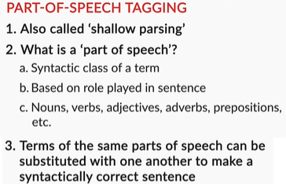
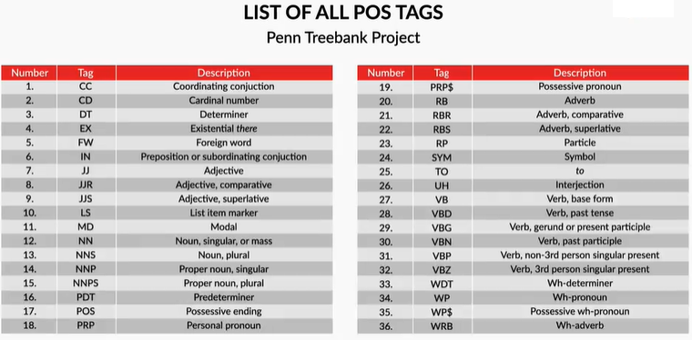
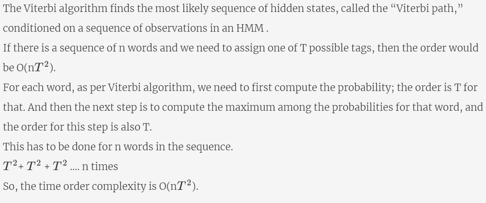

# Syntactic Processing

## Introduction
**In this module**, you will learn algorithms and techniques used to analyse the syntax or the grammatical structure of sentences. In the first session, you will learn the basics of grammar (part-of-speech tags etc.) and write your own algorithms such as **HMMs(Hidden Markov Models) to build POS taggers**. In the second session, you will study algorithms to **parse the grammatical structure** of sentences such as CFGs, PCFGs and dependency parsing. Finally, in the third session, you will learn to build an **Information Extraction (IE)** system to parse flight booking queries for users using techniques such as **Named Entity Recognition (NER)**. You will also study a class of models called **Conditional Random Fields (CRFs)** which are widely used for building NER systems.

All these techniques fall under what is called **syntactic processing**.  

Syntactic processing is widely used in applications such as question answering systems, information extraction, sentiment analysis, grammar checking etc.

### The What and Why of Syntactic Processing
Let’s start with an example to understand **Syntactic Processing**:
* Canberra is the capital of Australia.
* Is Canberra the of Australia capital.

Both sentences have the same set of words, but only the first one is syntactically correct and comprehensible. Basic lexical processing techniques wouldn't be able to tell this difference. Therefore, more sophisticated syntactic processing techniques are required to understand the relationship between individual words in the sentence.

Lexical analysis is data pre-processing and feature extraction step. It involves the analysis at word level. Syntactical analysis aims at finding structural relationships among the words of a sentence.

We’ve learnt about lexical processing in the last module. Lexical analysis aims at data cleaning and feature extraction, which it does by using techniques such as lemmatization, removing stopwords, rectifying misspelt words, etc. But, in syntactic analysis, our aim will be to understand the roles played by the words in the sentence, the relationship between words and to parse the grammatical structure of sentences. 

Now that we understand the basic idea of syntactic processing, let's study the different levels of syntactic analysis.

### Parsing
A key task in syntactical processing is **parsing**. It means to break down a given sentence into its 'grammatical constituents'. Parsing is an important step in many applications which helps us better understand the linguistic structure of sentences.

Let’s understand parsing through an example. Let's say you ask a question answering (QA) system, such as Amazon's Alexa or Apple's Siri, the following question: "Who won <u>the cricket world cup in 2015</u>?"

The QA system can respond meaningfully only if it can understand that the phrase <u>'cricket world cup'</u> is related to the phrase 'in 2015'. The phrase <u>'in 2015'</u> refers to a specific time frame, and thus modifies the question significantly. Finding such dependencies or relations between the phrases of a sentence can be achieved using parsing techniques.

Let's take another example sentence to understand how a parsed sentence looks like: "The quick brown fox jumps over the table". The figure given below shows the three main constituents of this sentence. Note that actual parse trees are different from the simplified representation below.

This structure divides the sentence into three main constituents:
* 'The quick brown fox' is a noun phrase 
* 'jumps' is a verb phrase
* 'over the table' is a prepositional phrase.

To summarise, you will study the following levels of syntactic analysis in this module:
* Part-of-speech (POS) tagging
* Constituency parsing
* Dependency parsing

Let’s understand the levels of syntax analysis using an example sentence: "The little boy went to the park."

**POS tagging** is the task of assigning a part of speech tag (POS tag) to each word. The POS tags identify the linguistic role of the word in the sentence. The POS tags of the sentence are:

**Constituency parsers** divide the sentence into constituent phrases such as noun phrase, verb phrase, prepositional phrase etc. Each constituent phrase can itself be divided into further phrases. The constituency parse tree given below divides the sentence into two main phrases - a noun phrase and a verb phrase. The verb phrase is further divided into a verb and a prepositional phrase, and so on.

**Dependency Parsers** do not divide a sentence into constituent phrases, but rather establish relationships directly between the words themselves. The figure below is an example of a dependency parse tree of the sentence given above (generated using the spaCy dependency visualiser(https://explosion.ai/demos/displacy?text=The%20little%20boy%20went%20to%20the%20park&model=en_core_web_sm&cpu=0&cph=0)). In this module, you’ll understand when dependency parsing is more useful than constituency parsing and study the elements of dependency grammar.

We will study these parsing techniques in the sections that follow. In the next few segments, we will study POS tagging in detail.

### Parts-of-Speech
Let’s start with the first level of syntactic analysis- POS (parts-of-speech) tagging. A word can be tagged as a noun, verb, adjective, adverb, preposition etc. depending upon its role in the sentence. Assigning the correct tag such as noun, verb, adjective etc. is one of the most fundamental tasks in syntactic analysis.  

Let’s say you ask your smart home device a question - "Ok Google, where can I get the permit to work in Australia?". Now, the word 'permit' can potentially have two POS tags - noun and a verb. In the phrase 'I need a work permit', the correct tag of 'permit' is 'noun'. On the other hand, in the phrase "Please permit me to take the exam.", the word 'permit' is a 'verb'.

Assigning the correct POS tags helps us better understand the intended meaning of a phrase or a sentence and is thus a crucial part of syntactic processing. In fact, all the subsequent parsing techniques (constituency parsing, dependency parsing etc.) use the part-of-speech tags to parse the sentence. 

**Note**: You do not need to remember all the POS tags except for a few which are listed later on this page. You’ll pick up most of these tags as you work on the problems in the coming segments, but it’s important to be aware of all the types of tags. Now, let’s look at some other tags.

There are 36 POS tags in the Penn treebank in NLTK. The file given below enlists the most commonly used POS tags. It is recommended to remember these common tags. It’ll help you avoid the trouble of looking up meanings of tags in the upcoming segments, so you can focus on the core concepts.  

[POS tags](dataset/POS_tags.pdf)

Note that the set of POS tags is not standard - some books/applications may use only the base forms such as NN, VB, JJ etc without using granular forms, though NLTK uses this set of tags(https://www.ling.upenn.edu/courses/Fall_2003/ling001/penn_treebank_pos.html). Since we'll use NLTK heavily, we recommend you to read through this list of tags at least once.

### Additional Reference:
Refer to segments 1 & 2 of the POS tagging chapter of NLTK (http://www.nltk.org/book/ch05.html).

### Different Approaches to POS Tagging
Now that you are familiar with the commonly used POS tags, we will discuss techniques and algorithms for POS tagging. We will look at the following four main techniques used for POS tagging:
* Lexicon-based
* Rule-based
* Probabilistic (or stochastic) techniques
* Deep learning techniques

This session will cover the first three tagging approaches in detail and the basics of deep-learning based taggers. Deep-learning based models will be covered in detail in the Neural Networks section.

The four approaches of POS tagging are as follows:

**The lexicon-based** approach uses the following simple statistical algorithm: for each word, it assigns the POS tag that most frequently occurs for that word in some training corpus. Such a tagging approach cannot handle unknown/ambiguous words. For example:
* I went for a **run/NN**
* I **run/VB** in the morning
Lexicon tagger will tag 'run' basis the highest frequency tag. In most contexts, 'run' is likely to appear as a verb, implying that 'run' will be wrongly tagged in the first sentence.

But if there’s a rule that is applied to the entire text, such as, 'replace VB with NN if the previous tag is DT', or 'tag all words ending with ing as VBG', the tag can be corrected. **Rule-based** tagging methods use such an approach. Rule-based taggers are also known as syntagmatic taggers.

**Probabilistic taggers** don't naively assign the highest frequency tag to each word, instead, they look at slightly longer parts of the sequence and often use the tag(s) and the word(s) appearing before the target word to be tagged.

We’ll go through the details of probabilistic tagging approaches in the upcoming segments.

### Lexicon and Rule-based POS Tagging
We saw that the **lexicon tagger** uses a simple statistical tagging algorithm: for each token, it assigns the most frequently assigned POS tag. For example, it will assign the tag "verb" to any occurrence of the word "run" if "run" is used as a verb more often than any other tag.

**Rule-based taggers** first assign the tag using the lexicon method and then apply predefined rules. Some examples of rules are:
1. Change the tag to VBG for words ending with ‘-ing’
2. Changes the tag to VBD for words ending with ‘-ed’
3. Replace VBD with VBN if the previous word is 'has/have/had'

Defining such rules require some exploratory data analysis and intuition.

In this segment, we’ll learn to implement the lexicon and rule-based tagger on the Treebank corpus of NLTK(http://www.nltk.org/howto/corpus.html#corpus-reader-objects). Let’s first explore the corpus.

#### Programming Exercise - Exploratory Analysis for POS Tagging
In the following practice exercise, you will use the Jupyter notebook attached below to answer the following questions. The notebook contains some starter code to read the data and explain its structure. We recommend you to try answering the questions by writing code to conduct some exploratory analysis.

[Treebank EDA](dataset/Treebank_EDA.ipynb)

Now that you have an intuition of how lexicon and rule-based taggers work, let's build these taggers in NLTK. Since NLTK comes with built-in functions for lexicon and rule-based taggers, called Unigram and Regular Expression taggers respectively in NLTK, we'll use them to train taggers using the Penn Treebank corpus.

You can refer to this Stack Overflow answer to learn more about the backoff technique(https://stackoverflow.com/questions/17259970/tagging-pos-in-nltk-using-backoff-ngrams). Next, you will study a widely used probabilistic POS tagging model - the Hidden Markov Model (HMM).

### Stochastic Parsing
In the following segments, we’ll study a commonly used probabilistic algorithm for POS tagging - the Hidden Markov Model (HMM). 

Before moving ahead, it will be useful to recall the **Bayes’ theorem** and the chain rule of probability which you had learnt in the Naive Bayes module. Say you have two features X= (x1, x2) and a binary target variable y (class = 0/1). According to the **Bayes’ rule**, the probability of a point (x1, x2) belonging to the class c1 is given by:

Now, according to the **chain rule of probability**, the term P(x1, x2 | c1) can be rewritten as P(x1|c1). P(x2|c1).  You can now compute all the probabilities on the right-hand side to compute P(class = c1 | x1, x2).

A similar idea is used by probabilistic parsers to assign POS tags to sequences of words. Say you want to tag the word sequence ‘The high cost’ and you want to compute the probability that the tag sequence is (DT, JJ, NN). For simplicity, let's work with only these three POS tags, and also assume that only three tag sequences are possible - (DT, JJ, NN), (DT, NN, JJ) and (JJ, DT, NN).

The probability that the tag sequence is (DT, JJ, NN) can be computed as:

Similarly, we can compute the probabilities of the other two sequences and assign the sequence that has the maximum probability. We will need to use some simplifying assumptions to compute the right-hand side of the equation. Let’s see how.

Let’s analyse the process of stochastic parsing step by step.

The objective is to find the **most probable POS tag sequence** for the phrase: 'The high cost'.We have made a simplifying assumption that only three possible tags exist: Determinant (DT), Adjective (JJ) and Noun(NN).

Each word in the sentence can be assigned any one of the three tags DT, JJ or NN. So, there could be 3^3 = 27 possible tag sequences (DT-DT-DT, DT-JJ-NN, DT-JJ-JJ, ....). For simplicity, we’ll consider only these three possible tag sequences:
1. (DT, JJ, NN)
2. (DT, NN, JJ)
3. (JJ, DT, NN)

We need to find the maximum of [P(**tag sequence|observation sequence**)] among the possible tag sequences. Let’s start with first tag sequence: (DT, JJ, NN)

We make an important assumption here called the **Markov assumption**. (You’ll learn about the Markov process formally in the upcoming segments). Briefly, a Markov process transitions from one 'state' to another with some probability. In this case, the states are the POS tags.

The Markov assumption states that the probability of a state depends only on the probability of the previous state leading to it. That implies, in a tag sequence (DT, JJ, NN), the probability that a word is tagged as NN depends only on the previous tag JJ and not on DT. 

Another simplifying assumption we make is that the probability of a word w being assigned a tag t depends only on the tag t and not on any other tag. Thus, the probability P(the|DT), i.e. the probability that a word is 'the' given its tag is DT, depends only on DT and not on any of the other tags NN or JJ.

Simplifying the equation using these assumptions, we get:

The denominator can simply be ignored since it is the same across all candidate sequences.

In the next segment, you’ll see how to optimally arrive at a solution for getting the most probable tag sequence without calculating the probabilities for the 27 tag sequences.

### The Viterbi Heuristic
In the previous segment, you learnt how to calculate the probability of a tag sequence given a sequence of words. The idea is to compute the probability of all possible tag sequences and assign the sequence having the maximum probability.

Although this approach can work in principle, it is computationally very expensive. For e.g. if you have just three POS tags - DT, JJ, NN, and you want to tag the sentence "The high cost", there are 

Clearly, computing trillions of probabilities to tag a 10-word sentence is impractical. Thus, we need to find a much more efficient approach to tagging. 

 One such approach called the **Viterbi heuristic**, also commonly known as the **Viterbi algorithm**.

This is also why it is called a greedy algorithm - it assigns the tag that is most likely at every word, rather than looking for the overall most likely sequence. In the following segment we will compare the computational costs of the two tagging algorithms - the brute force algorithm and the Viterbi algorithm.

### Markov Chain and HMM
Markov models are probabilistic (or stochastic) models that were developed to model sequential processes. In a Markov process, it is usually assumed that the probability of each event (or state) depends only on the probability of the previous event. This simplifying assumption is a special case which is known as the Markovian, one-Markov and the first-order Markov assumption. 

Let’s summarise the theory of Markov processes and HMMs.

A Markov chain is used to represent a process which performs a transition from one state to other. This transition makes an assumption that the probability of transitioning to the next state is dependent solely on the current state. Consider the figure below:

Here, ‘a’, ‘p’, ‘i’, ‘t’, ‘e’, ‘h’ are the **states** and the numbers mentioned on the edges are **transition probabilities**. For e.g. the probabilities of transitioning from the state ‘t’ to the states ‘i’, 'a' and 'h' are 0.3, 0.3, 0.4 respectively.

The **start state** is a special state which represents the initial state of the process (e.g. the start of a sentence).

**Markov processes** are commonly used to model sequential data, such as text and speech. For e.g., say you want to build an application which predicts the next word in a sentence. You can represent each word in a sentence as a state. The transition probabilities (which can be learnt from some corpus, more on that later) would represent the probability that the process moves from the current word to the next word. For e.g. the transition probability from the state 'San' to 'Franciso' will be higher than to the state 'Delhi'.

The **Hidden Markov Model (HMM)** is an extension to the Markov process which is used to model phenomena where the **states are hidden** (or latent) and they **emit observations**. For example, in a speech recognition system (a speech-to-text converter), the states represent the actual text words which you want to predict, but you do not directly observe them (i.e. the states are hidden). Rather, you only observe the speech (audio) signals corresponding to each word, and you need to infer the states using the observations.

Similarly, in POS tagging, what you observe are the words in a sentence, while the POS tags themselves are hidden. Thus, you can model the POS tagging task as an HMM with the hidden states representing POS tags which emit observations, i.e. words.

The hidden states **emit observations** with a certain probability. Therefore, along with the transition and initial state probabilities, Hidden Markov Models also have **emission probabilities** which represent the probability that an observation is emitted by a particular state.

The figure below illustrates the emission and transition probabilities for a hidden Markov process having three hidden states and four observations.

In the previous segment, you had used the transition and the emission probabilities for finding the most probable tag sequence for the sentence "The high cost". The probabilities P(NN|JJ), P(JJ|DT) etc. are transition probabilities, while the P(high|JJ), P(cost|NN) etc. are the emission probabilities.

### Explanation Problem
In the previous segment, you learnt how the POS tagging problem can be modelled using an HMM. You saw that the sequence of words are the observations while the POS tags are the hidden states. Also, the HMM is represented by its initial state probabilities (i.e. the probability of transition into any state from the initial state), the transition and the emission probabilities.

These probabilities are usually learnt from a training corpus. For now, let's assume that you have already learnt these probabilities. Then, the **explanation problem**, also called the **decoding problem**, is as follows: Given a sequence of words/observations and an HMM model (i.e. transition, emission and start state probabilities), find the tag/state sequence which maximises the probability of observing the observed words. 

To summarise, since the explanation problem is exponential in the number of tags, we need to find a more efficient algorithm to solve it. You already know that the Viterbi algorithm solves this problem. 

Let us see how to visualise the HMM as a trellis and solve the problem explanation problem using the Viterbi algorithm.

Thus, we have used the same phrase for tagging 'The high cost' and have assumed that we have only three possible tags - DT, JJ, NN. We have also assumed some emission (P('the'|DT),  P( 'the '|NN), P('high'|JJ), etc.) and transition probabilities (P(NN|JJ), P(JJ|DT), P(DT|JJ), etc.). You'll learn how to calculate these probabilities from a tagged corpus in the next segment.

We will demonstrate how to calculate the most probable tag sequence using the Viterbi Heuristic.

Note that the Viterbi algorithm, as demonstrated in the previous lecture, is an example of a dynamic programming algorithm. In general, algorithms which break down a complex problem into subproblems and solve each subproblem optimally are called dynamic programming algorithms. 

Until now, we had assumed some initial state, transition and emission probabilities and used them to compute the optimal tag sequence. But how do you actually learn these probabilities? This task is done using some tagged corpus, such as the Penn Treebank, and is called **the learning problem**.

In the next segments, you'll learn to solve the learning problem and write an algorithm Python to train your own HMM model using the Viterbi algorithm.

#### Additional References:

Likelihood problem of predicting the next possible word can be solved using forward algorithm. You can read about it in more detail from this link: https://web.stanford.edu/~jurafsky/slp3/9.pdf   (Refer to the section 9.3)

### Learning HMM Model Parameters
In this segment, you'll learn to compute the emission & transition probabilities from a tagged corpus. This process of learning the probabilities from a tagged corpus is called **training an HMM model**.

To summarise, the emission and the transition probabilities can be learnt as follows:

**Emission Probability** of a word 'w' for tag 't':  
P(w|t) = Number of times w has been tagged t/Number of times t appears

**Transition Probability** of tag t1 followed by tag t2:  
P(t2|t1) = Number of times t1 is followed by tag t2/ Number of times t1 appears

### HMM and the Viterbi Algorithm: Pseudocode
You have learnt the basic idea behind the two main problems in building an HMM for POS tagging  - the learning problem (learning the probabilities) and the explanation problem (solved using the Viterbi algorithm). In the next segment, you will learn to build an HMM using the Penn Treebank as the training corpus.

Before that, let's take a while to reiterate the important concepts and understand the pseudocode of this program.

The Penn Treebank is a manual of around a million words taken from 1989 Wall Street Journal's articles. This manual is available in NLTK toolkit of Python. You can explore this data by importing NLTK and then run the following code:

The 'wsj' object is a list of list of tuples. Each tuple is in the form of (word, POS tag). You have already performed EDA on the Treebank data while building the lexicon and rule-based taggers.

### Learning the HMM Model Parameters
Let's start with training the HMM to learn the probabilities. For this, you need to calculate the **transition probability** (from one state to another), the **emission probability** (of a state emitting a word), and the **initial state probabilities** (of a state appearing at the start of a sentence).

**Transition Probability**  
Transition probability is the probability of moving from one state to another. You learnt how to calculate it in the last segment.  Let’s write the pseudocode to calculate the transition probabilities.

### The Explanation/Decoding Problem: Viterbi Algorithm
After learning the model parameters, we need to find the best possible state (tag) sequence for each given sentence. We'll use the Viterbi algorithm - for every word w in the sentence, a tag t is assigned to w such that it maximises the likelihood of the occurrence of P(tag|word).

In other words, we assign the tag t to the word w which has the max P(tag|word).  

We'll keep on storing the assigned tags and words as a list of tuples. As we move to the next word in the list, each tag to be assigned will use the tag of the previous word. You may find **the trellis** quite useful to visualise the algorithm. 

For the start word of a sentence, which is a 'boundary case', the sentence terminator of the previous tag can be used to calculate the initial state probabilities.

This forms the basis of developing a POS tagger using the Viterbi heuristic. In the next segment, we'll see how to implement this pseudocode in Python.

### HMM & the Viterbi Algorithm: Python Implementation
You will now learn to build an HMM POS tagger using the Penn Treebank dataset as the training corpus.
In the following few exercises, you will learn to do the following in Python:

We will explain the Python implementation step-by-step. Please download the following Jupyter notebook.

[Viterbi POS tagging](dataset/POS_Tagging_HMM.ipynb)

So, we explored the Penn Treebank data set. The tagged sentences are in the form of a list of tuples, where the first element of the tuple is a word and the second element is the POS tag of the word. We have also sampled the data into train and test sets.

You saw how to compute the emission, transition and the initial state probabilities (P(tag | start)). Note that a sentence can end with either of the three terms '.', '?' or '!'. They are all called sentence terminators and are tagged as '.'. Thus, P(tag|start) is equivalent to P(tag| '.').

Next, you'll compute the transition probabilities matrix and finally use the emission and the transition probabilities to write the Viterbi algorithm for tagging a given sequence of words.

To summarise, the Viterbi algorithm works as follows:

For each word, we compute the P(tag|word) for each tag in the tag set and then assign the tag having the max P(tag/word).

P(tag|word)  = (emission probability of the word-tag pair) * (transition probability from the previous tag).

As we move along each word, we keep on storing the assigned tags in a list. As we progress further down the sequence, each word uses the tag of the previous token to compute the transition probabilities. 

Let's evaluate the accuracy of the Viterbi algorithm on the test dataset. Predicting the tags of the entire test-set takes about 3-4 hours. So, we'll compute the tagging accuracy on a few randomly chosen sentences.

The Viterbi algorithm gave us approximately 87% accuracy. The 13% loss of accuracy, to a large part, can be attributed to the fact that when the algorithm hits an unknown word (i.e. not present in the training set), it naively assigns the first tag in the list of tags that we have created. In this case, the first tag happens to be JJ, so it assigns JJ to all unknown words.

### Improving the Performance of the POS Tagger
You can, of course, try to improve the accuracy of the model further by making some modifications. For example, you can start by tagging the unknown words more smartly. Also, using some exploratory analysis, you can identify whether any particular sets of tags or words constitute to a large number of errors, understand the source of those errors, and address them head-on. These are left as exercises for you. 

In the next segment, you will briefly understand the fundamentals of Recurrent Neural Networks (RNNs) and how they are used for POS tagging.

### Deep Learning Based POS Taggers
Apart from conventional sequence models such as HMMs, significant advancement has been made in the field of Neural Networks (or deep learning) based sequence models. Specifically, **Recurrent Neural Networks (RNNs)** have empirically proven to outperform many conventional sequence models for tasks such as POS tagging, entity recognition, dependency parsing etc. 

Though you’ll learn RNNs in detail later in the Neural Network course, this segment will give you a brief overview of how you can build POS taggers using RNNs.

We will study RNNs in much more detail in the Neural Networks course. 